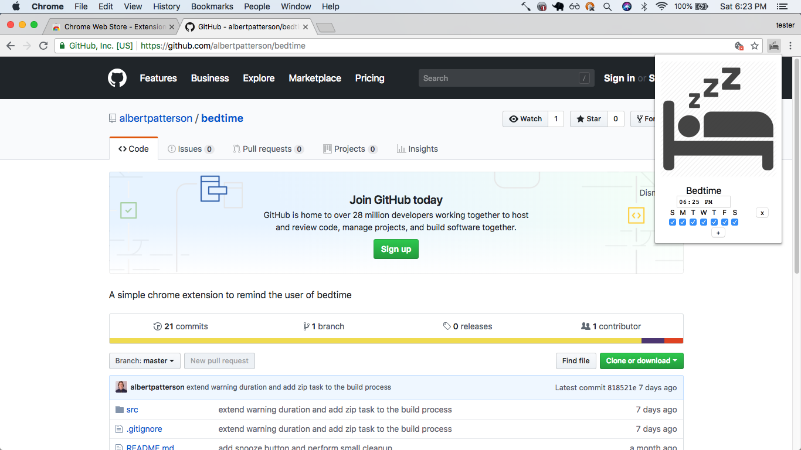
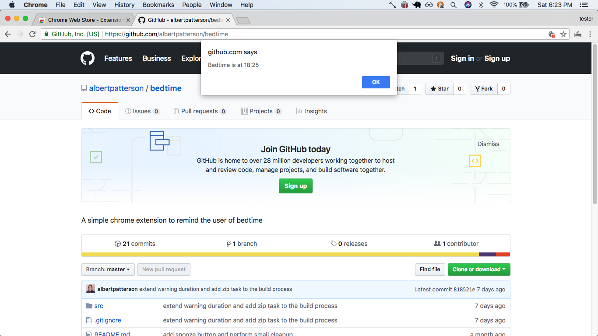
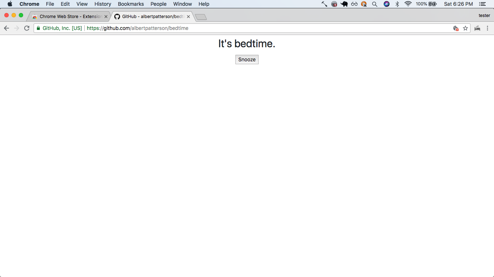

# bedtime
A chrome extension to prevent users from using the browser after bedtime.

## Prerequisites
The Chrome browser: [download](https://www.google.com/chrome)

## Installation
Install via one of the following:
* From the [Chrome Web Store](https://chrome.google.com/webstore/detail/bedtime/mmpagflnajemfdambnmlfobldahjfbne)
* From local files
    1. Clone this repository
    2. Build the project via `npm run build`
    3. Open [chrome://extensions/](chrome://extensions/)
    4. Choose "Load Unpacked" and select this project's "dist" folder
    
## Usage
* **Set a bedtime alarm via the extension popup:**

    * multiple alarms can be added and deleted as needed
    * alarms can be set to only activate on certain days
* **A warning is shown when bedtime is near:**

    * this warning will be shown automatically 1 hour from bedtime as well as every time a page loads
    * this should make it possible to continue using the browser while keeping in mind that the user should begin wrapping up
* **The contents of the page is hidden once bedtime arrives:**

    * this should render the browser unusable so that the user will not be tempted to stay up past bedtime

## Development
* Build the unpacked extension via `npm run build`
* Build the unpacked extension and watch for changes via `npm run dev`
* Build the unpacked extension and zip the extension as required for submission to the chrome web store via `npm run build-prod`

## License
This project is licensed under the MIT License - see the [LICENSE.md]() file for details
